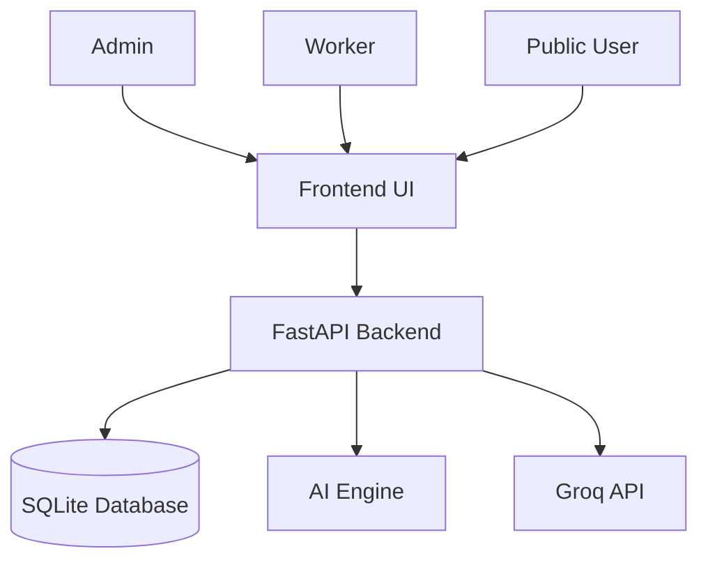
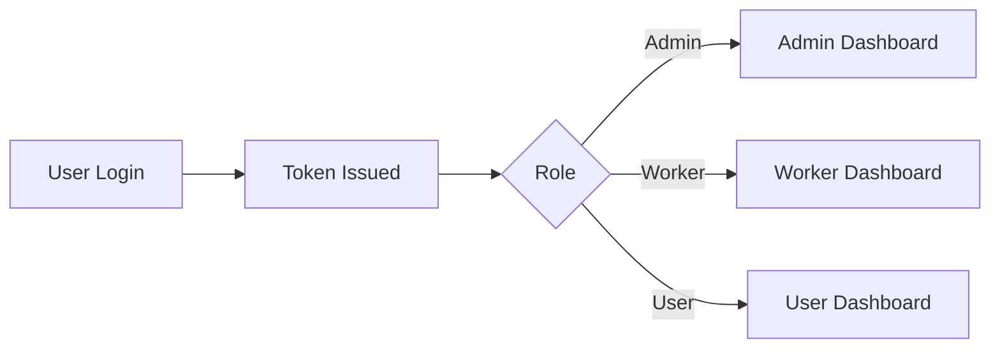
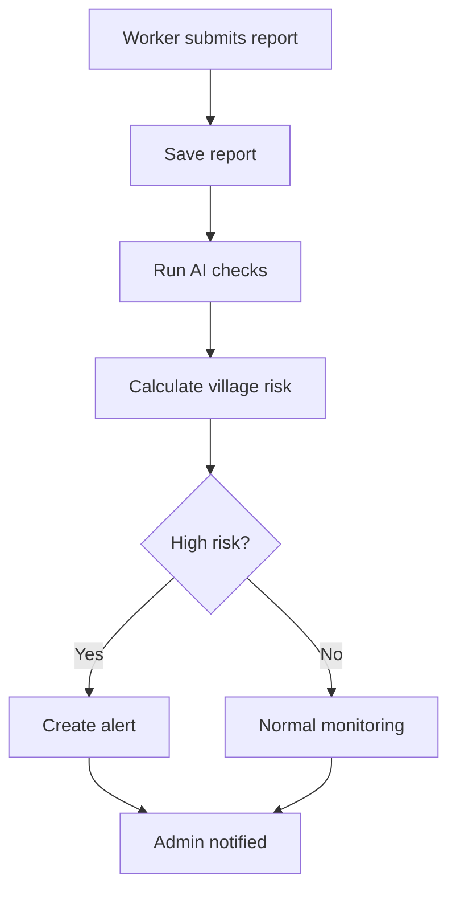
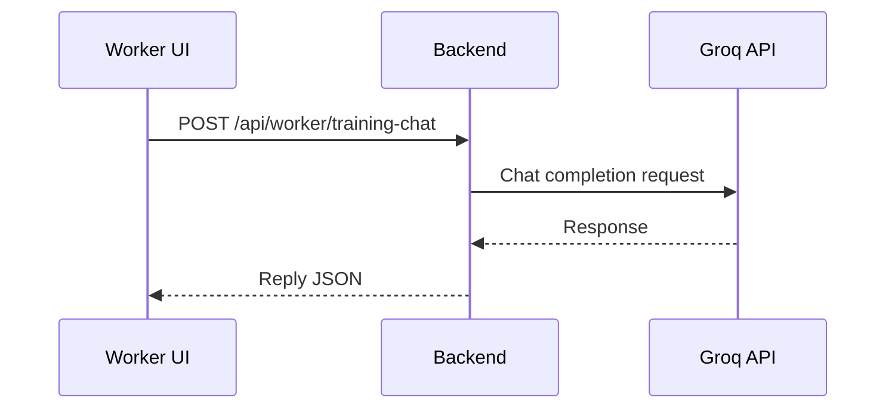

# Project Documentation

## Smart Community Health Monitoring and Early Warning System

Version: 1.0  
Date: 2026-03-26

---

## 1. Introduction

The Smart Community Health Monitoring and Early Warning System is a role-based web application for monitoring possible water-borne disease outbreaks in villages and districts.

It enables:
- health workers to submit case reports,
- public users to submit symptom reports,
- administrators to monitor trends, manage workers, and issue alerts,
- AI-assisted risk scoring for early intervention.

---

## 2. Problem Statement

In many rural areas, disease signals are fragmented and reported late. This delays preventive action and increases outbreak impact. A centralized digital platform is needed to collect reports quickly, evaluate risk, and guide health response.

---

## 3. Objectives

- Build a simple and low-cost reporting platform for health monitoring.
- Provide role-based dashboards for admin, worker, and public users.
- Detect village-level risk early using data-driven scoring.
- Support alert and notice broadcasting for rapid awareness.
- Offer worker training support via chatbot integration.

---

## 4. Scope

### In Scope
- User registration and role-based login.
- Worker report submission (single and bulk).
- Public symptom reporting.
- Risk analytics and trend dashboards.
- Alerts, notices, notifications.
- CSV export for admin.
- Worker training chatbot via Groq API.

### Out of Scope
- Native mobile app.
- Production-grade multi-tenant cloud infra.
- Full EMR/HIS integration.

---

## 5. Technology Stack

### Backend
- FastAPI
- Uvicorn
- python-jose (JWT)
- httpx
- sqlite3

### Frontend
- HTML5
- CSS3
- Vanilla JavaScript
- Chart.js

### AI/ML Libraries
- scikit-learn
- LightGBM
- XGBoost
- NumPy
- Pandas

### Data Storage
- SQLite (WAL mode)

---

## 6. System Architecture



### Layer Description
- Presentation Layer: frontend pages and role-based JavaScript modules.
- API Layer: authentication, report, analytics, and integration endpoints.
- Data Layer: SQLite relational tables.
- Intelligence Layer: heuristic + optional model-based risk functions.

---

## 7. Project Structure

```text
Health_wath_ne/
|- run.py
|- requirements.txt
|- README.md
|- ReportREADME.md
|- PROJECT_DOCUMENTATION.md
|- backend/
|  |- main.py
|  |- database.py
|  |- auth.py
|  |- ai_engine.py
|  |- uploads/
|  \- .env
\- frontend/
   |- index.html
   |- css/style.css
   \- js/
      |- app.js
      |- auth.js
      |- admin.js
      |- worker.js
      |- user.js
      \- utils.js
```

---

## 8. Database Design

### Main Tables
- users
- health_reports
- symptom_reports
- alerts
- notifications
- water_sources
- predictions
- notices

### Key Relations
- users.id -> health_reports.worker_id
- users.id -> alerts.created_by
- users.id -> notices.created_by
- users.id -> notifications.user_id

---

## 9. Functional Modules

### 9.1 Authentication Module
- Registration and login.
- JWT token generation and validation.
- Role-based access control.

### 9.2 Worker Module
- Submit case reports.
- Bulk report upload.
- View and update own reports.
- Access training chatbot.

### 9.3 Admin Module
- Approve/reject workers.
- Monitor dashboards and trends.
- View flagged reports.
- Send alerts and notices.
- Export reports as CSV.
- Check Groq integration status.

### 9.4 User/Public Module
- Submit symptom reports.
- Check risk status.
- View alerts and notices.
- Receive notifications.

### 9.5 AI Engine Module
- Symptom score calculation.
- Disease match prediction.
- Fake/suspicious report detection.
- Village risk scoring and early warning support.

---

## 10. API Overview

### Authentication
- POST /api/auth/register
- POST /api/auth/login

### Admin
- GET /api/admin/workers
- POST /api/admin/workers/{worker_id}/approve
- POST /api/admin/workers/{worker_id}/reject
- GET /api/admin/reports
- GET /api/admin/dashboard
- GET /api/admin/worker-performance
- GET /api/admin/flagged-reports
- POST /api/admin/alerts
- POST /api/admin/notices
- GET /api/admin/water-sources
- GET /api/admin/trends
- GET /api/admin/export/csv
- GET /api/admin/integrations/groq-status

### Worker
- POST /api/worker/reports
- POST /api/worker/reports/bulk
- GET /api/worker/my-reports
- PUT /api/worker/reports/{report_id}
- POST /api/worker/training-chat

### User/Public
- POST /api/user/symptom-report
- GET /api/user/risk-status
- GET /api/user/my-reports
- GET /api/alerts
- GET /api/notices
- GET /api/notifications
- POST /api/notifications/read-all
- GET /api/districts
- GET /api/villages
- GET /api/predictions
- GET /api/weather/{city}

---

## 11. Workflow Documentation

### 11.1 Login and Role Routing


### 11.2 Worker Report Flow


### 11.3 Worker Chatbot Flow


---

## 12. Security Considerations

- JWT-based authentication for API access.
- Role-based route protection for admin and worker actions.
- Account approval enforcement for workers.
- Inactive account blocking.
- Environment variables for API keys.
- Upload directory isolation for report media files.

Recommended hardening for production:
- move static JWT secret to environment variable,
- enforce HTTPS,
- add rate limiting,
- add audit logging,
- rotate API keys regularly.

---

## 13. Setup and Run

### Prerequisites
- Python 3.8+

### Install
```bash
pip install -r requirements.txt
```

### Configure
Update backend/.env:
```env
WEATHER_API_KEY=your_openweather_key
GROQ_API_KEY=your_groq_key
GROQ_MODEL=llama-3.1-8b-instant
```

### Run
```bash
python run.py
```

### Access
- http://127.0.0.1:8000

---

## 14. Testing Checklist (Manual)

- Register/login for each role.
- Verify worker approval flow.
- Submit single and bulk worker reports.
- Confirm dashboard stats refresh.
- Trigger and verify alert/notices.
- Check notifications read-all flow.
- Validate Groq status check in admin dashboard.
- Validate worker chatbot response and fallback behavior.

---

## 15. Known Limitations

- SQLite limits horizontal scaling.
- No built-in automated test suite yet.
- Limited localization and offline support.
- Secrets and config validation can be improved.

---

## 16. Future Enhancements

- Add automated unit/integration tests.
- Add Docker and deployment profiles.
- Add role-based audit trail and activity logs.
- Add geospatial map overlays for hotspots.
- Add multilingual support.
- Add SMS/WhatsApp alert integration.

---

## 17. Conclusion

This project provides a practical and lightweight disease surveillance system that can help communities identify high-risk situations early and coordinate timely public-health action through a single digital platform.
