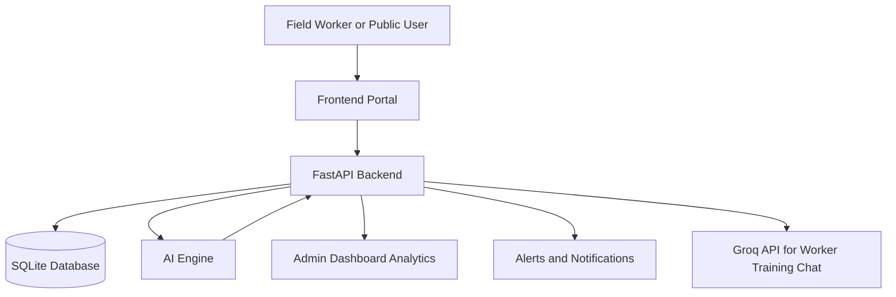
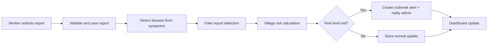
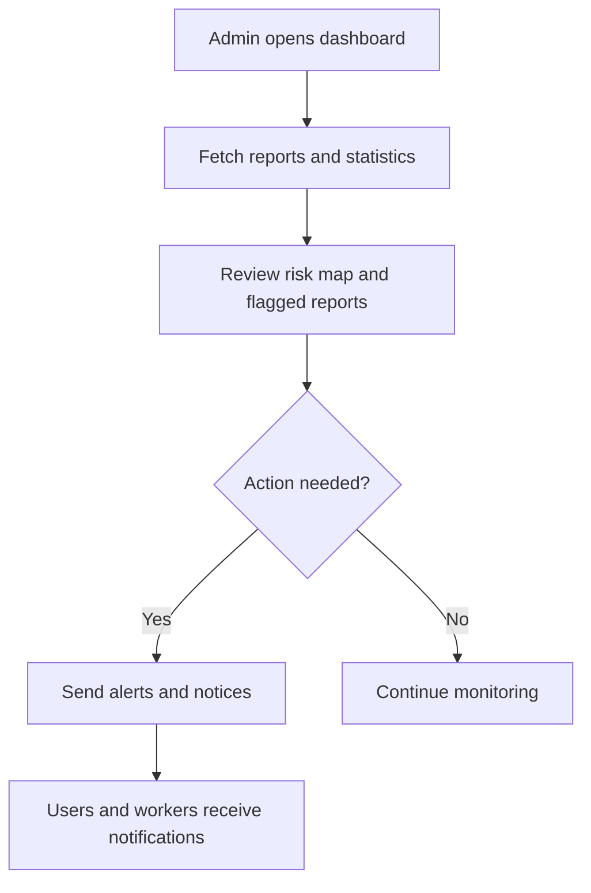
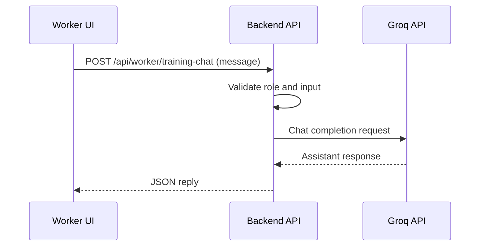

# Smart Community Health Monitoring and Early Warning System

This project is a full-stack, role-based health surveillance platform focused on early detection of water-borne disease risk at village and district level.

It combines:
- field data capture by health workers,
- public symptom submissions,
- AI-based risk scoring and anomaly checks,
- admin analytics, alerts, and action workflows.

---

## 1. Project Overview

### 1.1 Problem Statement
Rural and semi-urban regions often face delayed outbreak detection because case signals are fragmented across field workers, public complaints, and local environmental risk factors.

### 1.2 Solution Summary
This system centralizes health incident reporting and converts incoming records into:
- village-level risk indicators,
- flagged suspicious reports,
- actionable alerts and notices,
- trend dashboards for decision makers.

---

## 2. Technology Stack

### 2.1 Backend Stack
- Framework: FastAPI
- Server: Uvicorn
- Auth: JWT via python-jose + FastAPI HTTPBearer
- HTTP client: httpx
- File handling: python-multipart, aiofiles
- Reporting export: CSV streaming

### 2.2 Frontend Stack
- HTML5, CSS3, Vanilla JavaScript (no frontend framework)
- Charting: Chart.js
- Role-based UI modules:
  - admin.js
  - worker.js
  - user.js
  - app.js (orchestration)

### 2.3 Data Layer
- Database: SQLite (WAL mode, foreign keys enabled)
- Access pattern: raw SQL via sqlite3

### 2.4 AI and Analytics Stack
- Built-in risk logic in ai_engine.py
- Libraries available:
  - scikit-learn
  - LightGBM
  - XGBoost
  - NumPy
  - Pandas
- External LLM integration for worker training chatbot:
  - Groq Chat Completions API

### 2.5 Python Dependencies
See requirements.txt for exact versions.

---

## 3. Project Structure

```text
Health_wath_ne/
|- run.py
|- requirements.txt
|- README.md
|- backend/
|  |- main.py
|  |- database.py
|  |- auth.py
|  |- ai_engine.py
|  |- uploads/
|  \- .env
\- frontend/
   |- index.html
   |- css/style.css
   \- js/
      |- app.js
      |- auth.js
      |- admin.js
      |- worker.js
      |- user.js
      \- utils.js
```

---

## 4. Core Modules and Responsibilities

### 4.1 backend/main.py
Main API service containing:
- authentication routes,
- admin routes,
- worker routes,
- user/public routes,
- integrations (Groq status + worker training chat),
- static frontend serving and upload file serving.

### 4.2 backend/database.py
Initializes database schema and default admin record.

### 4.3 backend/auth.py
Handles:
- password hashing and verification,
- JWT token creation and decoding,
- role guards (admin and worker).

### 4.4 backend/ai_engine.py
Contains:
- symptom scoring,
- disease matching,
- fake-report detection,
- village risk scoring,
- optional model-driven signal calculations.

### 4.5 frontend/js/app.js
Decides role-based dashboard entry and triggers corresponding module load.

---

## 5. Data Model (SQLite)

Main tables:
- users
- health_reports
- symptom_reports
- alerts
- notifications
- water_sources
- predictions
- notices

Key relationships:
- users.id -> health_reports.worker_id
- users.id -> alerts.created_by
- users.id -> notices.created_by
- users.id -> notifications.user_id

---

## 6. API Surface (High-Level)

### 6.1 Authentication
- POST /api/auth/register
- POST /api/auth/login

### 6.2 Admin APIs
- GET /api/admin/workers
- POST /api/admin/workers/{worker_id}/approve
- POST /api/admin/workers/{worker_id}/reject
- GET /api/admin/reports
- GET /api/admin/dashboard
- GET /api/admin/worker-performance
- GET /api/admin/flagged-reports
- POST /api/admin/alerts
- POST /api/admin/notices
- GET /api/admin/water-sources
- GET /api/admin/trends
- GET /api/admin/export/csv
- GET /api/admin/integrations/groq-status

### 6.3 Worker APIs
- POST /api/worker/reports
- POST /api/worker/reports/bulk
- GET /api/worker/my-reports
- PUT /api/worker/reports/{report_id}
- POST /api/worker/training-chat

### 6.4 User and Public APIs
- POST /api/user/symptom-report
- GET /api/user/risk-status
- GET /api/user/my-reports
- GET /api/alerts
- GET /api/notices
- GET /api/notifications
- POST /api/notifications/read-all
- GET /api/districts
- GET /api/villages
- GET /api/predictions
- GET /api/weather/{city}

---

## 7. End-to-End Working Flow

### 7.1 Authentication and Session Flow
1. User logs in with role-aware account.
2. Backend verifies credentials and approval status.
3. JWT token is returned.
4. Frontend stores token and role info in local storage.
5. app.js routes UI to admin, worker, or user dashboard.

### 7.2 Worker Reporting Flow
1. Worker submits case report (single or bulk).
2. Backend stores records.
3. AI engine computes:
   - disease hints,
   - suspicious/fake-report checks,
   - village risk updates.
4. If risk level is severe, alert creation logic is triggered.
5. Admin dashboard immediately reflects latest metrics.

### 7.3 Admin Monitoring Flow
1. Admin opens dashboard.
2. Dashboard fetches analytics and recent reports.
3. Admin reviews village risk map, trends, flagged reports.
4. Admin can issue alerts and notices.
5. Notifications are delivered to target users/workers.

### 7.4 Worker AI Training Chat Flow
1. Worker asks chatbot question in UI.
2. Frontend calls POST /api/worker/training-chat.
3. Backend checks GROQ_API_KEY and forwards prompt to Groq API.
4. Reply returned to worker UI.
5. If API fails in frontend layer, local fallback answers are used.

---

## 8. Flowcharts

### 8.1 Overall System Flow



### 8.2 Worker Report Submission Flow



### 8.3 Admin Action Flow



### 8.4 Worker Training Chat Flow



---

## 9. Security and Access Control

- JWT-based stateless authentication.
- Role checks enforced via dependency guards:
  - require_admin
  - require_worker
- Worker approval workflow enforced before account usage.
- Inactive account blocking is applied during login.
- Sensitive keys are loaded from backend/.env at startup.

---

## 10. Configuration

Create or update backend/.env with:

```env
WEATHER_API_KEY=your_openweather_key
GROQ_API_KEY=your_groq_key
GROQ_MODEL=llama-3.1-8b-instant
```

---

## 11. How to Run

### 11.1 Install Dependencies

```bash
pip install -r requirements.txt
```

### 11.2 Start Application

```bash
python run.py
```

### 11.3 Open in Browser

http://127.0.0.1:8000

---

## 12. Default Admin Account

On first initialization:
- Username: admin
- Password: admin123

Change this password after first login in production usage.

---

## 13. Typical Operational Scenario

1. Admin approves newly registered workers.
2. Workers submit daily field reports.
3. AI layer updates risk and flags suspicious records.
4. Admin reviews trends and sends alerts/notices.
5. Users check risk status and receive safety guidance.
6. Worker chatbot provides process guidance using Groq.

---

## 14. Key Strengths of the Project

- Lightweight architecture (FastAPI + SQLite + Vanilla JS).
- Clear role-based operational flow.
- Explainable risk workflow using both heuristic and model signals.
- Real-time administrative visibility over village/district data.
- Integrated AI assistant for worker guidance.

